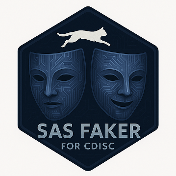

# sas_faker
SAS package to create dummy data in CDISC format for clinical trials
Purpose: A macro to generate dummy clinical trial data. Creates datasets in SDTM (DM, AE, SV, VS) and ADaM (ADSL, ADAE，ADVS, ADTTE) formats.
Generates pseudo subject data, vital signs, study visits, and adverse events based on user-specified group numbers and sample sizes.

  

~~~sas  
/*example*/
%sas_faker(n_groups=2,
                 n_per_group=50, 
                 output_lib=WORK)
~~~

# dm domain
Dummy is designed to be a randomized parallel-group　study, with a low probability of discontinuation or death data.

# ae domain
For rights reasons, meddra variables have non-standard CDISC variable names, event names are dummy generated, and the dictionary form has the same structure as MedDRA, but is specific and different from MedDRA

# vs domain
Synchronized with the VISIT information of SV domain.

# sv domain
Synchronized with the VISIT information of the domain of the Finding Class.

